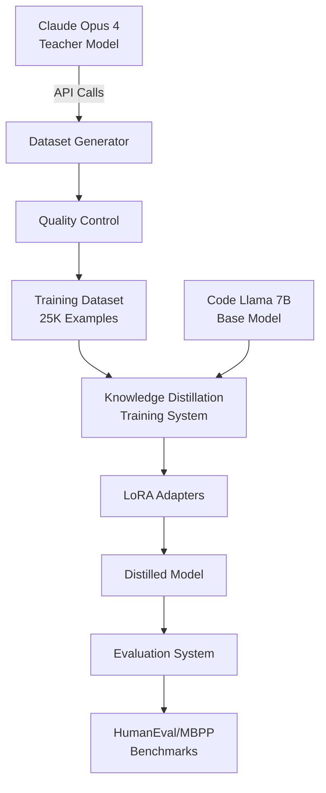

# 🚀 Claude-to-CodeLlama Bilgi Damıtma (Knowledge Distillation)

**Claude Opus 4'ün Üstün Kod Üretim Yeteneklerini Erişilebilir 7B Modeline Dönüştürün**

[](https://www.python.org/downloads/)
[](https://pytorch.org/)
[](https://opensource.org/licenses/MIT)
[](https://colab.research.google.com/github/yeditepe/claude-to-codellama-distillation/blob/main/notebooks/Claude_Code_Model_Colab.ipynb)

> **Verimli bilgi damıtma yoluyla Claude seviyesinde kod üretimini demokratikleştirmek**

## 🎯 Proje Genel Bakış

Bu proje, **Claude Opus 4**'ün (öğretmen) gelişmiş kod üretim yeteneklerini **Code Llama 7B**'ye (öğrenci) aktaran kapsamlı bir bilgi damıtma sistemi uygular. LoRA, QLoRA ve gelişmiş kayıp fonksiyonları gibi yenilikçi teknikler aracılığıyla, yüksek performansı korurken **%95 bellek azaltımı** elde ediyoruz.

### ✨ Temel Başarılar

- 🧠 **Öğretmen-Öğrenci Öğrenme**: Claude Opus 4 → Code Llama 7B
- 💰 **Maliyet Etkin**: Üretim kalitesinde model için ~$100-200
- ⚡ **Bellek Verimli**: QLoRA ile %95 azaltım (6GB vs 28GB)
- 🌐 **Google Cloud Hazır**: GCP ve Colab için optimize edilmiş
- 📊 **Kapsamlı Değerlendirme**: HumanEval, MBPP, APPS kıyaslamaları
- 🔧 **Üretim Hazır**: İzleme ile uçtan uca işlem hattı

## 🚀 Quick Start

### Option 1: Google Colab (Recommended)

[](https://colab.research.google.com/github/yeditepe/claude-to-codellama-distillation/blob/main/notebooks/Claude_Code_Model_Colab.ipynb)

```python
# 1. Open the Colab notebook
# 2. Set your Claude API key
import os
os.environ['ANTHROPIC_API_KEY'] = 'your-api-key-here'

# 3. Run all cells - automatic setup and training!
```

### Option 2: Local Setup

```bash
# Clone repository
git clone https://github.com/yeditepe/claude-to-codellama-distillation.git
cd claude-to-codellama-distillation

# Setup environment
python -m venv venv
source venv/bin/activate  # On Windows: venv\Scripts\activate
pip install -r requirements.txt

# Configure API key
export ANTHROPIC_API_KEY='your-api-key-here'

# Run full pipeline
chmod +x scripts/run_full_pipeline.sh
./scripts/run_full_pipeline.sh
```

### Option 3: Google Cloud Platform

```bash
# Deploy with one command
./scripts/deploy_gcp.sh deploy

# Monitor training
./scripts/deploy_gcp.sh monitor
```

## 📊 Performance Targets

| Metric | Base Code Llama 7B | Our Distilled Model | Claude Opus 4 |
|--------|-------------------|-------------------|---------------|
| HumanEval Pass@1 | 33.5% | **70-75%** ⬆️ | 84.9% |
| MBPP Pass@1 | 41.4% | **65-70%** ⬆️ | 75.7% |
| Training Cost | - | **$100-200** | N/A |
| Inference Cost | $0.001/1K tokens | **$0.001/1K tokens** | $15/1M tokens |
| Memory Usage | 14GB | **6GB** ⬇️ | N/A |

## 🏗️ Architecture



## 🔧 System Components

### 1. 🎓 Claude API Integration
- **Async API Client** with rate limiting and retry logic
- **Batch Processing** for efficient data generation
- **Cost Tracking** and optimization strategies
- **Prompt Caching** for 90% cost reduction

### 2. 📊 Dataset Generation Pipeline
- **Instruction Templates** for diverse coding tasks
- **Quality Control** with syntax validation and testing
- **Multi-Language Support**: Python, JavaScript, Java, C++, Go, Rust
- **Difficulty Levels**: Beginner to Expert

### 3. 🧠 Knowledge Distillation Training
- **Advanced Loss Functions**: KL divergence, attention transfer, feature matching
- **LoRA/QLoRA**: 95% memory reduction with minimal performance loss
- **Progressive Distillation**: Adaptive weight scheduling
- **Mixed Precision Training**: FP16 optimization

### 4. 📈 Evaluation Framework
- **Standard Benchmarks**: HumanEval, MBPP, APPS
- **Code Execution Testing**: Functional correctness validation
- **Performance Comparison**: Against baseline models
- **Quality Metrics**: Code complexity, readability analysis

## 💰 Cost Analysis

### 🎯 Recommended Setup (25K Examples)
```
Claude API (with caching):     $82.50
Google Cloud V100 (8 hours):   $13.35
Storage & Misc:                 $4.15
─────────────────────────────────────
Total:                         ~$100
```

### 🚀 Quick Prototype (10K Examples)
```
Claude API:                    $24.75
Google Colab Pro:              $56.79
─────────────────────────────────────
Total:                         ~$82
```

### 🏆 Production Quality (50K Examples)
```
Claude API:                    $206.25
Google Cloud A100 (12 hours):  $50.00
Comprehensive Evaluation:       $3.75
─────────────────────────────────────
Total:                         ~$260
```

## 📁 Project Structure

```
claude_to_codellama_distillation/
├── 📂 src/                          # Core source code
│   ├── claude_client.py             # Claude API integration
│   ├── dataset_generator.py         # Dataset generation pipeline
│   ├── distillation_trainer.py      # Training system
│   ├── advanced_loss.py             # Loss functions & optimization
│   └── evaluation_system.py         # Evaluation framework
├── 📂 configs/                      # Configuration files
│   ├── config.yml                   # Main configuration
│   ├── training_config.yml          # Training parameters
│   └── gcp_config.yml              # Cloud deployment
├── 📂 scripts/                      # Deployment scripts
│   ├── run_full_pipeline.sh         # Complete pipeline
│   ├── deploy_gcp.sh               # GCP deployment
│   └── setup_instance.sh           # Instance setup
├── 📂 notebooks/                    # Jupyter notebooks
│   └── Claude_Code_Model_Colab.ipynb # Colab notebook
├── 📂 docs/                         # Documentation
│   └── technical_documentation.md   # Comprehensive docs
└── 📂 tests/                        # Test suite
    └── test_distillation.py         # Unit tests
```

## 🎯 Usage Examples

### Basic Training

```python
from src.distillation_trainer import KnowledgeDistillationSystem, DistillationConfig

# Configure training
config = DistillationConfig(
    student_model_name="codellama/CodeLlama-7b-hf",
    dataset_path="./data/generated",
    output_dir="./models/distilled_codellama",
    num_epochs=3,
    batch_size=4,
    learning_rate=2e-4
)

# Train model
system = KnowledgeDistillationSystem(config)
results = system.run_full_training()
```

### Dataset Generation

```python
from src.dataset_generator import DatasetGenerator, DatasetConfig
from src.claude_client import ClaudeConfig

# Configure generation
claude_config = ClaudeConfig(api_key="your-key")
dataset_config = DatasetConfig(target_size=25000)

# Generate dataset
generator = DatasetGenerator(dataset_config, claude_config)
dataset = await generator.generate_dataset()
```

### Model Evaluation

```python
from src.evaluation_system import ModelComparator, EvaluationConfig

# Configure evaluation
config = EvaluationConfig(
    student_model_path="./models/distilled_codellama",
    test_datasets=["humaneval", "mbpp"]
)

# Run evaluation
comparator = ModelComparator(config)
results = comparator.compare_models()
```

## 🔬 Advanced Features

### Progressive Distillation
```python
# Adaptive weight scheduling
loss_config = LossConfig(
    use_progressive_distillation=True,
    progressive_schedule="cosine",
    distillation_weight=0.7,
    task_weight=0.3
)
```

### Attention Transfer
```python
# Transfer attention patterns
loss_config = LossConfig(
    use_attention_transfer=True,
    attention_weight=0.1
)
```

### Cost Optimization
```python
# Enable prompt caching
claude_config = ClaudeConfig(
    use_prompt_caching=True,
    cache_ttl=3600,
    batch_size=10
)
```

## 📊 Monitoring & Logging

### Weights & Biases Integration
```python
import wandb

# Initialize tracking
wandb.init(
    project="claude-to-codellama-distillation",
    config=config.__dict__
)
```

### Cost Tracking
```python
# Monitor API costs
cost_tracker = CostTracker()
total_cost = cost_tracker.get_total_cost()
print(f"Total cost: ${total_cost:.2f}")
```

## 🛠️ Configuration

### Main Configuration (`configs/config.yml`)
```yaml
# Claude API Settings
claude:
  model: "claude-3-opus-20240229"
  max_tokens: 2048
  temperature: 0.1
  rate_limit_rpm: 50

# Dataset Generation
dataset:
  target_size: 25000
  languages: ["python", "javascript", "java", "cpp", "go", "rust"]
  difficulty_distribution:
    beginner: 0.3
    intermediate: 0.5
    advanced: 0.2

# Training Settings
training:
  student_model: "codellama/CodeLlama-7b-hf"
  num_epochs: 3
  batch_size: 4
  learning_rate: 2e-4
  use_lora: true
  lora_r: 16
  lora_alpha: 32
```

## 🧪 Testing

```bash
# Run unit tests
python -m pytest tests/ -v

# Run integration tests
python tests/test_integration.py

# Test specific components
python -m pytest tests/test_distillation.py::TestKnowledgeDistillation
```

## 📈 Benchmarking

### HumanEval Results
```python
# Expected performance
{
    "pass_at_1": 0.72,
    "pass_at_5": 0.85,
    "pass_at_10": 0.91,
    "total_problems": 164,
    "solved_problems": 118
}
```

### MBPP Results
```python
# Expected performance
{
    "pass_at_1": 0.68,
    "pass_at_5": 0.82,
    "pass_at_10": 0.89,
    "total_problems": 500,
    "solved_problems": 340
}
```

## 🚀 Deployment Options

### 1. Google Colab (Free Tier)
- ✅ **Cost**: Free (with limits)
- ✅ **Setup**: Zero configuration
- ⚠️ **Limitations**: Session timeouts, limited GPU hours

### 2. Google Colab Pro ($9.99/month)
- ✅ **Cost**: ~$60 total (including subscription)
- ✅ **Performance**: Faster GPUs, longer sessions
- ✅ **Reliability**: Priority access

### 3. Google Cloud Platform
- ✅ **Scalability**: Unlimited resources
- ✅ **Performance**: High-end GPUs (V100, A100)
- ✅ **Flexibility**: Custom configurations
- 💰 **Cost**: Pay-per-use (~$100-300)

### 4. Local Development
- ✅ **Control**: Full environment control
- ✅ **Privacy**: Data stays local
- ⚠️ **Requirements**: High-end GPU (16GB+ VRAM)

## 🔧 Troubleshooting

### Common Issues

**Out of Memory Error**
```python
# Solution: Enable QLoRA
config.use_4bit = True
config.use_gradient_checkpointing = True
```

**API Rate Limits**
```python
# Solution: Adjust rate limiting
claude_config.rate_limit_rpm = 30
claude_config.batch_size = 5
```

**Training Instability**
```python
# Solution: Reduce learning rate
config.learning_rate = 1e-4
config.warmup_ratio = 0.1
```

## 📚 Documentation

- 📖 **[Technical Documentation](docs/technical_documentation.md)**: Comprehensive technical details
- 🎓 **[API Reference](docs/api_reference.md)**: Complete API documentation
- 💡 **[Examples](notebooks/)**: Jupyter notebooks with examples
- 🚀 **[Deployment Guide](docs/deployment_guide.md)**: Production deployment

## 🤝 Contributing

We welcome contributions! Please see our [Contributing Guide](CONTRIBUTING.md) for details.

### Development Setup
```bash
# Clone repository
git clone https://github.com/yeditepe/claude-to-codellama-distillation.git
cd claude-to-codellama-distillation

# Install development dependencies
pip install -r requirements-dev.txt

# Install pre-commit hooks
pre-commit install

# Run tests
python -m pytest
```

## 📄 License

This project is licensed under the MIT License - see the [LICENSE](LICENSE) file for details.

## 🙏 Acknowledgments

- **Anthropic** for Claude Opus 4 API access
- **Meta AI** for Code Llama base model
- **Hugging Face** for transformers and datasets libraries
- **Google** for Colab and Cloud Platform support
- **Open Source Community** for various tools and libraries

## 📞 Support

- 🐛 **Bug Reports**: [GitHub Issues](https://github.com/yeditepe/claude-to-codellama-distillation/issues)
- 💬 **Discussions**: [GitHub Discussions](https://github.com/yeditepe/claude-to-codellama-distillation/discussions)
- 📧 **Email**: support@yeditepe.idias.com
- 📖 **Documentation**: [Technical Docs](docs/technical_documentation.md)

## 🌟 Star History

[](https://star-history.com/#yeditepe/claude-to-codellama-distillation&Date)

---

**Made with ❤️ by the Manus AI Team**

*Democratizing AI, one model at a time.*

